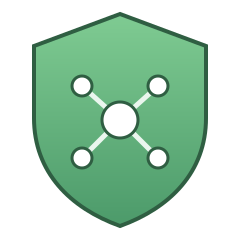

<p align="center">
  
</p>

<h1 align="center">AdGuardHub</h1>

<p align="center">
  One dashboard to manage multiple AdGuard&nbsp;Home instances as a single system.
</p>

<p align="center">
  
  
  
</p>

---

## The problem

If you run more than one AdGuard Home instance for DNS failover, you've probably hit this: a client fails over to instance **B**, you whitelist a domain there, and the next config sync from instance **A** silently overwrites it. Simple A→B sync tools only push config in one direction — they don't know (or care) that the whitelist you just added is the one that matters.

**AdGuardHub** fixes this by removing the need to sync between instances at all.

## How it works

AdGuardHub becomes the **single source of truth** for filtering rules, blocklist subscriptions, and instance settings. You never touch the native AdGuard UI again — every change goes through the hub and is pushed to **all** connected instances at once.

- **Instant push** on every change, to every instance
- **Best-effort, no rollback** — an unreachable instance never delays the others; its update goes to a retry queue and is applied as soon as it comes back
- **Reconciliation job** as a safety net — detects and auto-corrects drift (e.g. after downtime, or a change made in the native UI anyway), and logs every correction so nothing happens silently
- **Aggregated query log** across all instances, so you can whitelist a blocked domain no matter which instance saw it
- **Dynamic instance management** — add, remove, or disable AdGuard instances from the UI, no config file edits
- **Notifications** via configurable webhooks to Home Assistant, Discord, or Gotify

## Architecture

```
┌─────────────┐        push         ┌──────────────────┐
│             │ ──────────────────► │  AdGuard Home #1  │
│ AdGuardHub  │                     └──────────────────┘
│  (source of │        push         ┌──────────────────┐
│   truth)    │ ──────────────────► │  AdGuard Home #2  │
│             │                     └──────────────────┘
└─────────────┘
      ▲
      │ reconcile (drift detection)
      └──────────────────────────────────────────────────
```

Instances are reached through an adapter interface (`push_rules` / `pull_rules` / …), so a
Pi-hole adapter can be added later without reworking the sync core.

## Quick start

### Docker Compose

```yaml
services:
  adguardhub:
    image: ghcr.io/fgrfn/adguardhub:latest
    container_name: adguardhub
    restart: unless-stopped
    ports:
      - "80:80"
    volumes:
      - ./data:/data
    environment:
      ADGUARDHUB_SECRET_KEY: "<a long random string>"
      PUID: "1000"   # Unraid: 99
      PGID: "1000"   # Unraid: 100
```

```bash
docker compose up -d
```

### docker run

```bash
docker run -d --name adguardhub \
  -p 80:80 \
  -v "$PWD/data:/data" \
  -e ADGUARDHUB_SECRET_KEY="$(openssl rand -base64 48)" \
  -e PUID=1000 -e PGID=1000 \
  --restart unless-stopped \
  ghcr.io/fgrfn/adguardhub:latest
```

Then open <http://localhost> and create the admin account.

The container listens on **port 80**. If the host already serves something there,
publish it elsewhere — `-p 8080:80` — the container-side port stays 80.

### Updating

`docker compose up -d` on its own will **not** fetch a newer image: Docker reuses the
cached one whenever the tag already exists locally. To move to a newer release:

```bash
docker compose pull && docker compose up -d
```

To run your own checkout instead of the published image, `docker compose up -d --build`
builds from the working tree. Either way, the first log line tells you what you got:

```bash
docker logs adguardhub 2>&1 | head -5
# INFO adguardhub: AdGuardHub 0.1.0 starting as uid=1000 gid=1000, data dir /data
```

### File permissions (PUID / PGID)

A bind mount keeps the *host* directory's ownership, so the container has to run as a
user that may write there. Set `PUID`/`PGID` to whoever owns the mounted directory:

| Platform | PUID | PGID |
| --- | --- | --- |
| Unraid | `99` | `100` |
| Most Linux hosts (first user) | `1000` | `1000` |

The container starts as root only long enough for its entrypoint to `chown /data`, then
drops to `PUID:PGID` for the application itself. If the directory still isn't writable,
startup aborts with a single line naming the directory, the uid it tried, and the fix —
rather than a SQLAlchemy traceback.

> **Keep `ADGUARDHUB_SECRET_KEY` safe and stable.** It signs your session cookie *and* derives the
> key that encrypts your AdGuard admin passwords at rest — the key itself is never written to the
> database. If it changes, you'll have to re-enter the instance credentials. If it isn't set at
> all, AdGuardHub generates a random one per start and warns you in the UI.

### First run

1. **Add your instances** under *Instances* — base URL plus the AdGuard Home admin
   username/password. AdGuard has no granular API tokens, so it's the admin account or nothing;
   the password is encrypted before it's stored and is never sent back to the browser.
2. **Pick a master** and hit *Import as master*. Its rules and subscriptions become the hub's
   starting state, and every other instance is overwritten with it on the next push. There is no
   merge between instances — that's the whole point.
3. **Work only in AdGuardHub from here on.** Anything changed directly in a native AdGuard UI is
   detected by the next reconciliation run, corrected, and shown in the drift log.

## Configuration

All settings are environment variables prefixed with `ADGUARDHUB_`.

| Variable | Default | Purpose |
| --- | --- | --- |
| `ADGUARDHUB_SECRET_KEY` | *(random per start)* | Signs sessions and derives the credential encryption key. **Set this.** |
| `ADGUARDHUB_DATA_DIR` | `/data` | Where `adguardhub.db` lives. |
| `ADGUARDHUB_ADMIN_USERNAME` | — | Creates/updates the admin account on start. |
| `ADGUARDHUB_ADMIN_PASSWORD` | — | Password for the above. |
| `ADGUARDHUB_RECONCILE_INTERVAL` | `300` | Seconds between drift checks. |
| `ADGUARDHUB_RETRY_INTERVAL` | `30` | Seconds between retry-queue passes. |
| `ADGUARDHUB_QUERYLOG_POLL_INTERVAL` | `5` | Seconds between query log polls. |
| `ADGUARDHUB_QUERYLOG_BUFFER_SIZE` | `2000` | Entries kept in the in-memory log buffer. |
| `ADGUARDHUB_SESSION_MAX_AGE` | `1209600` | Session lifetime in seconds. |
| `ADGUARDHUB_HTTP_TIMEOUT` | `10` | Per-request timeout when talking to instances. |

## Notifications

Configure any number of webhook targets under *Settings*. Each can subscribe to specific events
or to all of them:

| Event | Fires when |
| --- | --- |
| `reconcile.fixed` | Reconciliation found (and corrected) drift on an instance |
| `instance.unreachable` | An instance stopped responding |
| `push.failed` | A push failed and went into the retry queue |

- **Home Assistant** — point it at `http://<ha>:8123/api/webhook/<id>` and trigger an automation
  on that webhook. The JSON body carries `event`, `title` and `message`.
- **Discord** — paste an incoming webhook URL.
- **Gotify** — use `https://<gotify>/message` and put the application token in the token field.

## Security

AdGuardHub is meant to run **inside your network**, alongside the AdGuard instances. It has a
single admin account (bcrypt-hashed password, signed session cookie) and no multi-user model.
Exposing it to the internet is not a supported deployment — put it behind a VPN or keep it on the
LAN.

## Development

Backend:

```bash
cd backend
python -m venv .venv && . .venv/bin/activate
pip install -r requirements.txt -r requirements-dev.txt
ADGUARDHUB_SECRET_KEY=dev ADGUARDHUB_DATA_DIR=./data uvicorn app.main:app --reload
```

Frontend (proxies `/api` to `127.0.0.1:8000`):

```bash
cd frontend
npm install
npm run dev
```

Local development stays on uvicorn's default port 8000 — binding 80 on a host needs root.
Only the container listens on 80.

Checks — the same ones CI runs:

```bash
cd backend && ruff check . && pytest
cd frontend && npm run lint && npm run build
```

In production the backend serves the built frontend from `ADGUARDHUB_STATIC_DIR`, so the whole
thing is one container and one port.

## Project layout

```
adguardhub/
├── backend/
│   ├── app/
│   │   ├── adapters/     # DnsAdapter interface + AdGuard Home implementation
│   │   ├── api/          # FastAPI routers
│   │   ├── services/     # sync, reconcile, querylog, notify, importer
│   │   ├── models.py     # SQLAlchemy models (the central state)
│   │   └── main.py
│   └── tests/
├── frontend/             # React + TypeScript (Vite)
├── .github/workflows/    # ci.yml, docker-publish.yml
├── Dockerfile
└── docker-compose.yml
```

## Roadmap

v0.1.0 covers the MVP: instance management, the central rule model with instant push,
reconciliation with a visible drift log, the aggregated query log, subscription management,
single-user login, and the three notifier types.

Planned, deliberately **not** in v1: Pi-hole support, per-client rule scoping, multi-user
accounts, and a maintenance mode for pausing reconciliation on a single instance.

## License

MIT
