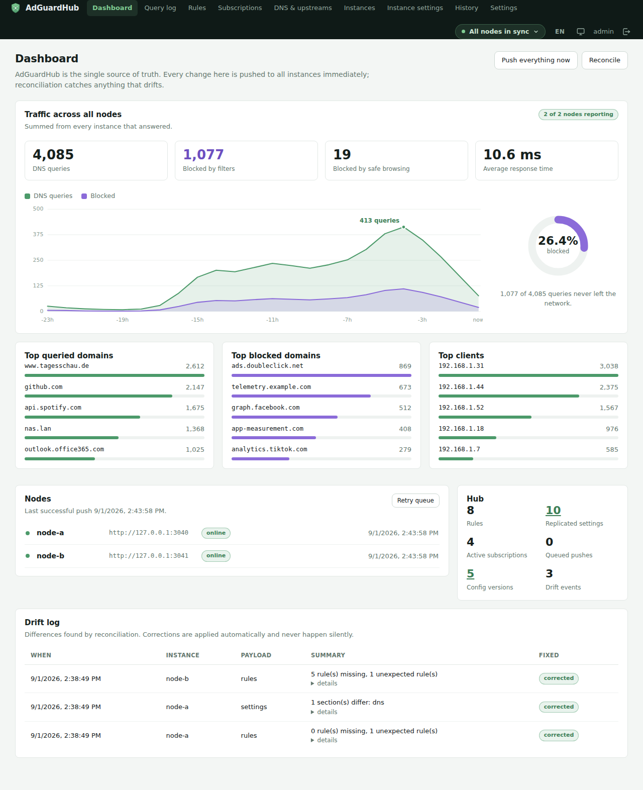
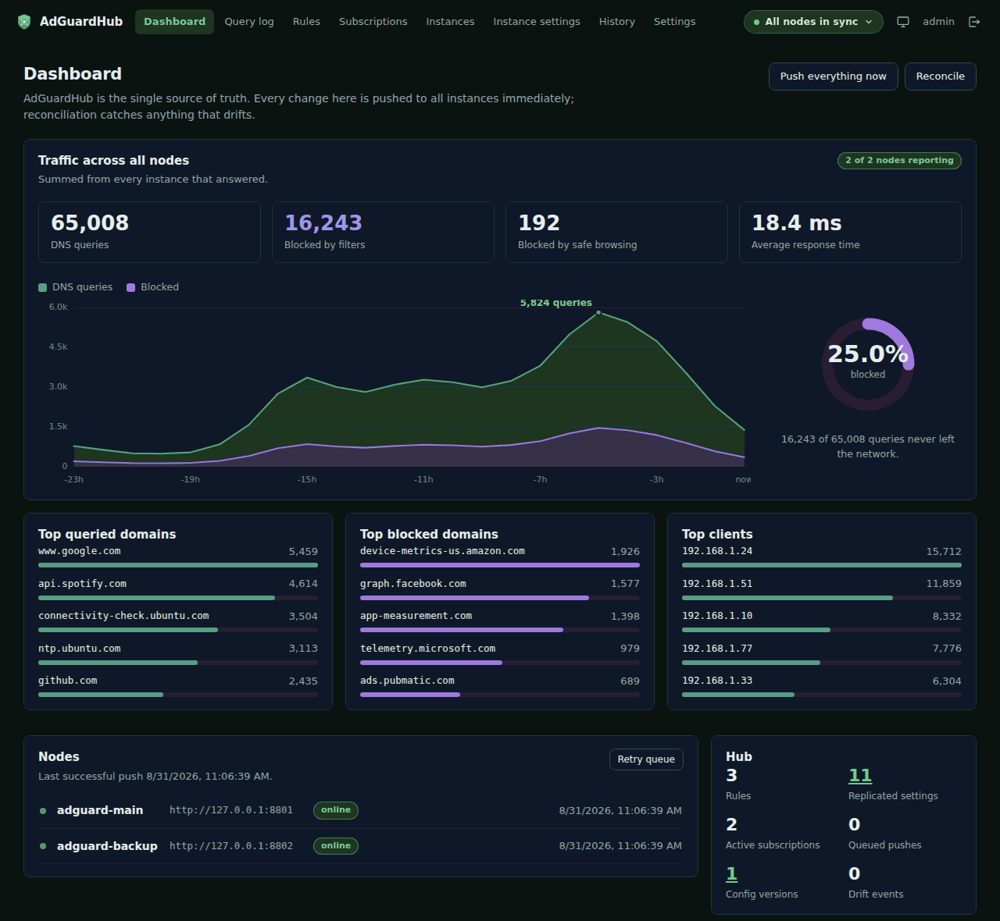
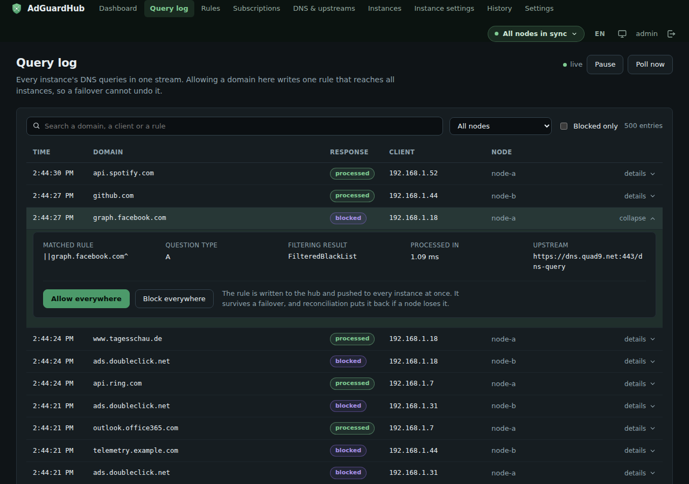
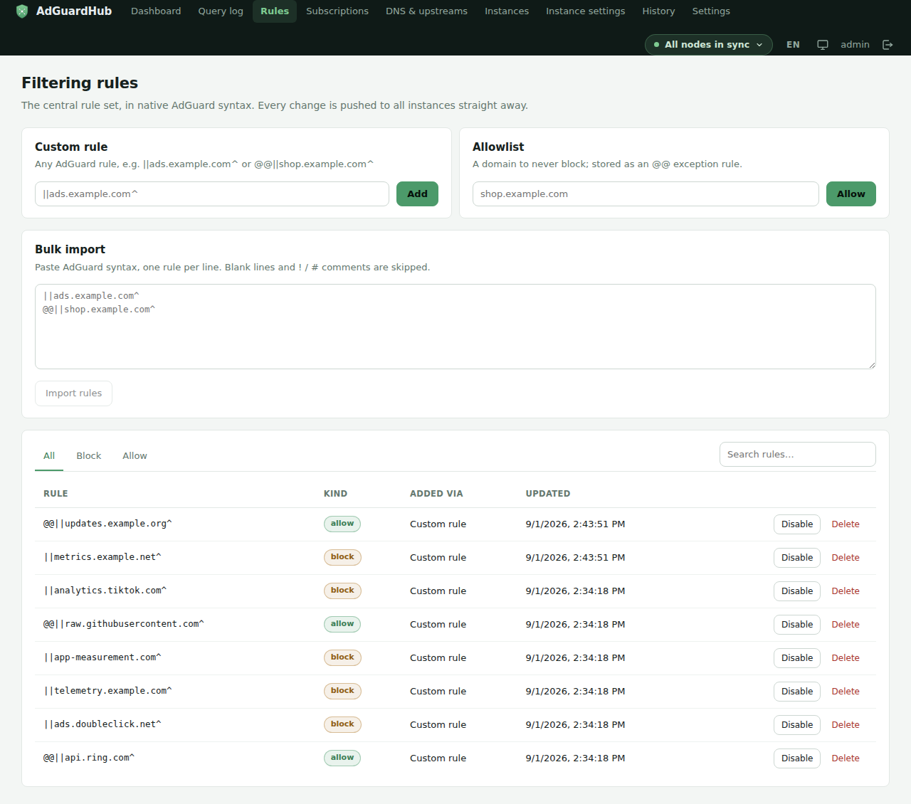
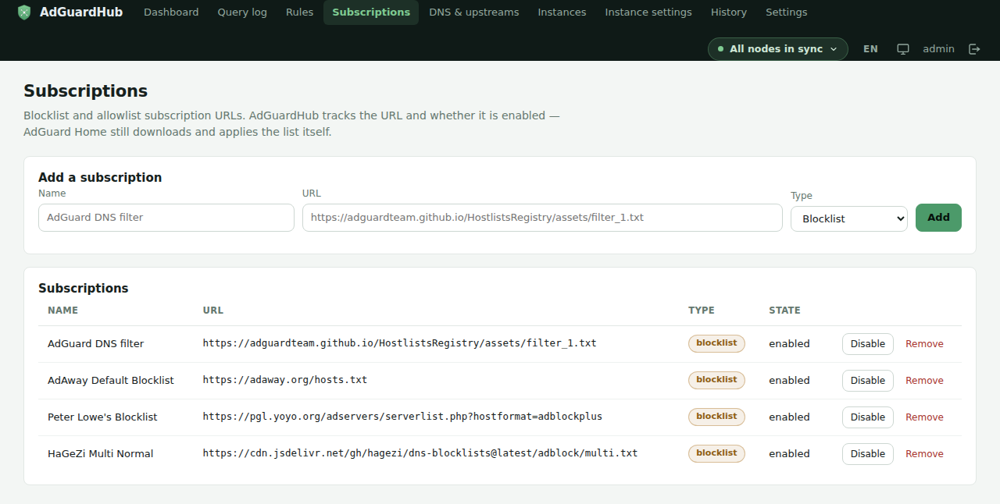
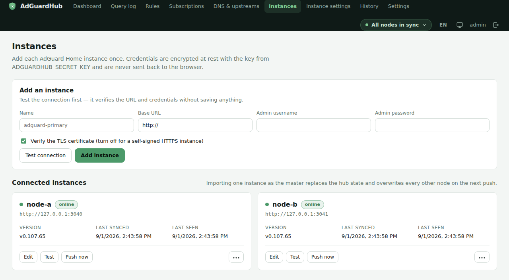
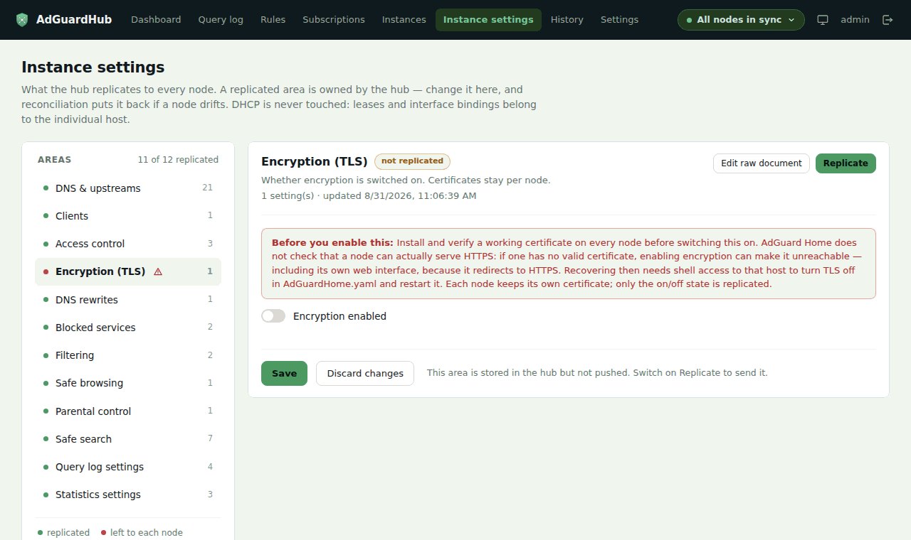
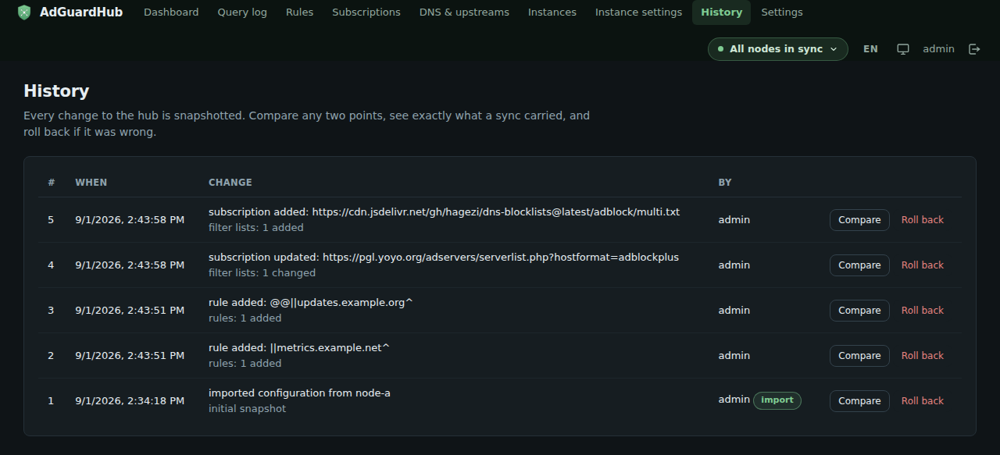
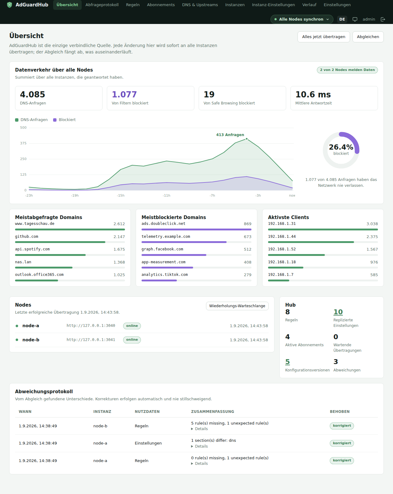

<p align="center">
  
</p>

<h1 align="center">AdGuardHub</h1>

<p align="center">
  One dashboard to manage multiple AdGuard&nbsp;Home instances as a single system.
</p>

<p align="center">
  
  
  
</p>

<p align="center">
  
</p>

<p align="center">
  <sub>Screenshots are from a local demo against two test instances, so the numbers are made up — the interface is not.</sub>
</p>

<details>
<summary>More screenshots — dark theme, query log, rules, subscriptions, instances, settings, history, German</summary>

<br />

Same dashboard, dark theme. Both ship; the default follows the operating system.



The aggregated query log. Every node's queries in one stream, newest first, with the node that
answered in its own column; a row opens onto the rule that matched, and allowing or blocking
from here writes one rule that reaches every node at once.



The central rule set, in native AdGuard syntax. Three ways in — a custom rule, a domain to
allow, or a pasted block — all writing to the same model.



Blocklist subscriptions. The hub tracks the URL and whether it is on; AdGuard Home still
downloads and applies the list itself, so the 700k-domain lists never touch this database.



Instances. Each AdGuard Home is added once, with credentials encrypted before they are stored.



Instance settings. The left column answers the page's real question — what the hub owns, and
what is left to each node.



Version history. Every change is a snapshot you can compare or roll back to.



The whole interface in German. The language follows the browser on first load and is switched
from the top bar; dates and numbers follow the language, not the browser.



</details>

---

## The problem

If you run more than one AdGuard Home instance for DNS failover, you've probably hit this: a client fails over to instance **B**, you whitelist a domain there, and the next config sync from instance **A** silently overwrites it. Simple A→B sync tools only push config in one direction — they don't know (or care) that the whitelist you just added is the one that matters.

**AdGuardHub** fixes this by removing the need to sync between instances at all.

## How it works

AdGuardHub becomes the **single source of truth** for filtering rules, blocklist subscriptions, and instance settings. You never touch the native AdGuard UI again — every change goes through the hub and is pushed to **all** connected instances at once.

- **Instant push** on every change, to every instance
- **Best-effort, no rollback** — an unreachable instance never delays the others; its update goes to a retry queue and is applied as soon as it comes back
- **Reconciliation job** as a safety net — detects and auto-corrects drift (e.g. after downtime, or a change made in the native UI anyway), and logs every correction so nothing happens silently
- **Aggregated query log** across all instances, so you can whitelist a blocked domain no matter which instance saw it
- **Dynamic instance management** — add, remove, or disable AdGuard instances from the UI, no config file edits
- **Full configuration replication** — not just filtering rules: DNS and upstreams, clients,
  encryption, access control, rewrites, blocked services, protection toggles and logging.
  DHCP is deliberately excluded, since leases and interface bindings are per-host state
- **Version history** — every change is snapshotted, so you can see what a sync carried,
  diff any two points, and roll back (the rollback is recorded too, so it can be undone)
- **Backup and restore** — everything the hub owns as one JSON document, validated in full
  before anything is written
- **AdGuard-compatible API** — point an existing client (a phone remote, Home Assistant, a
  script) at the hub instead of at one node, and what it changes is pushed everywhere
- **Notifications** via configurable webhooks to Home Assistant, Discord, or Gotify

## The interface

A flat top bar carries all eight areas, the way AdGuard Home's own UI does, and a status
element that is never off screen: green while every node carries the current configuration,
amber while a push waits in the retry queue, red when a node is unreachable or reconciliation
found drift. The whole point of the hub is that the nodes agree; when they stop agreeing, that
has to find you rather than wait to be looked up.

The dashboard leads with what the network actually did — queries over time, block rate, top
domains and clients, summed across every node — and says plainly how many nodes answered. A
total that is short by one node otherwise reads as a quiet day. Below that sits the hub's own
state: nodes, last push, queued pushes, drift.

Light and dark both ship, following the operating system by default with a manual override in
the top bar. There are no web fonts and no charting library: the hub runs on a local network
that may have no internet at all, so everything it renders is in the image.

English and German both ship as well. The language follows the browser on first load and is
switched from the top bar (or from the login card, before there is a top bar); the choice is
remembered per browser. Nothing about it is server-side, so two people can use the same hub in
different languages.

## Architecture

```
┌─────────────┐        push         ┌──────────────────┐
│             │ ──────────────────► │  AdGuard Home #1  │
│ AdGuardHub  │                     └──────────────────┘
│  (source of │        push         ┌──────────────────┐
│   truth)    │ ──────────────────► │  AdGuard Home #2  │
│             │                     └──────────────────┘
└─────────────┘
      ▲
      │ reconcile (drift detection)
      └──────────────────────────────────────────────────
```

Instances are reached through an adapter interface (`push_rules` / `pull_rules` / …), so a
Pi-hole adapter can be added later without reworking the sync core.

## Quick start

### Docker Compose

```yaml
services:
  adguardhub:
    image: ghcr.io/fgrfn/adguardhub:latest
    container_name: adguardhub
    restart: unless-stopped
    ports:
      - "80:80"
    volumes:
      - ./data:/data
    environment:
      ADGUARDHUB_SECRET_KEY: "<a long random string>"
      PUID: "1000"   # Unraid: 99
      PGID: "1000"   # Unraid: 100
```

```bash
docker compose up -d
```

### docker run

```bash
docker run -d --name adguardhub \
  -p 80:80 \
  -v "$PWD/data:/data" \
  -e ADGUARDHUB_SECRET_KEY="$(openssl rand -base64 48)" \
  -e PUID=1000 -e PGID=1000 \
  --log-opt max-size=10m --log-opt max-file=3 \
  --restart unless-stopped \
  ghcr.io/fgrfn/adguardhub:latest
```

The two `--log-opt` flags cap what Docker keeps of the container's output. Without them the
default driver keeps all of it forever — see [Logs](#logs).

Then open <http://localhost> and create the admin account.

The container listens on **port 80**. If the host already serves something there,
publish it elsewhere — `-p 8080:80` — the container-side port stays 80.

### Updating

`docker compose up -d` on its own will **not** fetch a newer image: Docker reuses the
cached one whenever the tag already exists locally. To move to a newer release:

```bash
docker compose pull && docker compose up -d
```

To run your own checkout instead of the published image, `docker compose up -d --build`
builds from the working tree. Either way, the first log line tells you what you got:

```bash
docker logs adguardhub 2>&1 | head -5
# INFO adguardhub: AdGuardHub 0.2.0 starting as uid=1000 gid=1000, data dir /data
```

The same version is on `GET /api/health` and at the foot of the *Settings* page, which is
usually the faster answer to "did the update land?". A published image reports the release
tag it was built from; one you built yourself reports `dev`, because it was not cut from a
tag and should not claim to have been.

### File permissions (PUID / PGID)

A bind mount keeps the *host* directory's ownership, so the container has to run as a
user that may write there. Set `PUID`/`PGID` to whoever owns the mounted directory:

| Platform | PUID | PGID |
| --- | --- | --- |
| Unraid | `99` | `100` |
| Most Linux hosts (first user) | `1000` | `1000` |

The container starts as root only long enough for its entrypoint to `chown /data`, then
drops to `PUID:PGID` for the application itself. If the directory still isn't writable,
startup aborts with a single line naming the directory, the uid it tried, and the fix —
rather than a SQLAlchemy traceback.

> **Keep `ADGUARDHUB_SECRET_KEY` safe and stable.** It signs your session cookie *and* derives the
> key that encrypts your AdGuard admin passwords at rest — the key itself is never written to the
> database. If it changes, you'll have to re-enter the instance credentials. If it isn't set at
> all, AdGuardHub generates a random one per start and warns you in the UI.

### First run

1. **Add your instances** under *Instances* — base URL plus the AdGuard Home admin
   username/password. AdGuard has no granular API tokens, so it's the admin account or nothing;
   the password is encrypted before it's stored and is never sent back to the browser.
2. **Pick a master** and hit *Import as master*. Its rules and subscriptions become the hub's
   starting state, and every other instance is overwritten with it on the next push. There is no
   merge between instances — that's the whole point.

   Naming a master is not compulsory. Skip the step and the hub starts from an empty rule set,
   which you then fill in here: settings you never touch stay switched off for replication, so
   an area the hub has no opinion about is left to each node rather than being flattened by an
   empty document. Import is the shortcut when one node already holds the configuration you
   want; it is not the only way in.
3. **Work only in AdGuardHub from here on.** Anything changed directly in a native AdGuard UI is
   detected by the next reconciliation run, corrected, and shown in the drift log.

## Configuration

All settings are environment variables prefixed with `ADGUARDHUB_`.

| Variable | Default | Purpose |
| --- | --- | --- |
| `ADGUARDHUB_SECRET_KEY` | *(random per start)* | Signs sessions and derives the credential encryption key. **Set this.** |
| `ADGUARDHUB_DATA_DIR` | `/data` | Where `adguardhub.db` lives. |
| `ADGUARDHUB_ADMIN_USERNAME` | — | Creates/updates the admin account on start. |
| `ADGUARDHUB_ADMIN_PASSWORD` | — | Password for the above. |
| `ADGUARDHUB_RECONCILE_INTERVAL` | `300` | Seconds between drift checks. |
| `ADGUARDHUB_RETRY_INTERVAL` | `30` | Seconds between retry-queue passes. |
| `ADGUARDHUB_QUERYLOG_POLL_INTERVAL` | `5` | Seconds between query log polls. |
| `ADGUARDHUB_QUERYLOG_BUFFER_SIZE` | `2000` | Entries kept in the in-memory log buffer. |
| `ADGUARDHUB_SESSION_MAX_AGE` | `1209600` | Session lifetime in seconds. |
| `ADGUARDHUB_HTTP_TIMEOUT` | `10` | Per-request timeout when talking to instances. |
| `ADGUARDHUB_LOG_LEVEL` | `INFO` | `DEBUG` adds the per-instance diagnostics — see [Logs](#logs). |
| `ADGUARDHUB_LOG_FILE` | — | Also write a rotating log file at this path. Empty means stderr only. |
| `ADGUARDHUB_LOG_FILE_MAX_BYTES` | `5242880` | Rotate the log file once it reaches this size. |
| `ADGUARDHUB_LOG_FILE_BACKUPS` | `3` | How many rotated log files to keep. |

`ADGUARDHUB_VERSION` is not in that list on purpose: it is build metadata, baked into the
image from the release tag by the Release workflow, not something to set at runtime.

The four interval/buffer timers only seed the initial values. Once the hub has started they are
edited under *Settings → Sync & timers* and take effect on the next worker cycle — no restart.

## Logs

Two different things are called a log here, and they are not the same:

- **The query log** is DNS traffic — what your clients asked for, aggregated across every
  instance. It lives in the UI and is what you use day to day.
- **The application log** is the hub talking about itself: what it did on start, a push that
  failed, a wrong password. It goes to stderr, so `docker logs adguardhub` (or
  `docker compose logs -f`) reads it back.

At the default `INFO` you get startup, schema migrations, notification failures, and
sign-ins. `ADGUARDHUB_LOG_LEVEL=DEBUG` adds the per-instance diagnostics — why a node's stats
came back empty, why a query log poll returned nothing — which is what you want while something
is misbehaving and nothing but noise the rest of the time. It also turns on the HTTP client's
own narration, which is verbose: on a hub polling two nodes it accounts for the large majority
of all output.

**Sign-ins are logged.** A wrong password writes a `WARNING` naming the source address and
which door was knocked on (the hub's login form, the AdGuard-compatible one, or Basic Auth),
and the attempt that trips the rate limit says so once. The attempted username is deliberately
not logged: with a single admin account it tells you nothing you don't know, and logging it
would write a password to disk the first time someone types one into the wrong box.

Set `ADGUARDHUB_LOG_FILE=/data/adguardhub.log` to also keep a rotating file (5 MB, three
backups by default). Most deployments do not need it — the container runtime already keeps a
copy — but it survives `docker rm` and is easier to hand to someone else. If the path cannot
be written, the hub says so and carries on with stderr rather than refusing to start.

Docker's default json-file driver keeps that copy **without any size limit**, which on a
long-running hub is a disk that fills quietly. The Compose example caps it; if you use
`docker run`, add the same:

```
--log-opt max-size=10m --log-opt max-file=3
```

## What gets replicated

Under *Instance settings*, each area can be replicated or left to the instance:

| Section | Covers |
| --- | --- |
| DNS & upstreams | Upstream/bootstrap/fallback resolvers, upstream mode, DNSSEC, cache, rate limits, blocking mode |
| Clients | Persistent clients and their per-client filtering settings |
| Access control | Allowed/disallowed clients, blocked hostnames |
| Encryption (TLS) | Whether encryption is on — certificates stay per node |
| DNS rewrites | Custom domain-to-answer rewrites |
| Blocked services | Globally blocked services and their schedule |
| Filtering | Filtering on/off and the list refresh interval |
| Safe browsing / Parental / Safe search | The protection modules |
| Query log & Statistics | Retention, anonymisation, ignored domains |

**DHCP is never touched.** Leases and interface bindings belong to the individual host;
copying them between nodes would be actively wrong.

Importing an instance as the master adopts every area it exposes and switches replication on.
An area a given AdGuard version does not implement is skipped rather than failing the sync.

> **On TLS — read before switching it on.** Install and verify a working certificate on **every**
> node first. AdGuard Home does not check that a node can actually serve HTTPS: if one has no
> valid certificate, enabling encryption can make it unreachable — including its own web
> interface, because it redirects to HTTPS. Recovering then needs shell access to that host to
> turn TLS off in `AdGuardHome.yaml` and restart it.
>
> Because of that, encryption is the one area an import adopts but leaves **switched off**; you
> enable it deliberately, and the UI confirms first. Only the on/off state is replicated: each
> node keeps its own certificate and hostname, and the push reads the target's current TLS
> settings and overlays just `enabled` — `/control/tls/configure` replaces the whole object, so a
> partial write would erase the node's certificate.

## Comments in the rule set

`!` and `#` lines are stored and replicated like any other line, in place. That matters more
than it sounds: a comment is usually the note saying *why* a rule exists — "allowed after the
doorbell app broke" — and since the hub owns the whole rule set, anything it does not store is
something reconciliation later removes from your nodes.

They appear under *Rules → Notes*, carry a neutral badge because they filter nothing, and are
edited and deleted like any other entry. Two limits worth knowing:

- **Identical comment lines collapse.** Rule text is unique in the hub, so using `!` twice as a
  bare separator keeps one of them. Notes with different wording are all kept.
- **Already-lost comments do not come back.** If an earlier version imported your rules and
  reconciliation stripped the comments from your nodes, that text is gone; re-import from a node
  that still has them, or add them again.

## Version history

Every change to the hub — a rule, a subscription, a settings section, an import — records a
snapshot. Under *History* you can:

- see what each change actually carried, summarised per entry
- compare any version against the current state or against another version, down to the
  individual settings key
- roll back to any version: the central state is replaced and pushed to every instance, and the
  rollback itself is recorded so it can be undone in turn

History is capped at the most recent 200 versions to keep the database small.

### What else is capped

Three tables would otherwise grow for as long as the hub runs. None of them grows quickly —
rows appear when something goes wrong, so a healthy hub barely accumulates any — but a node
that flaps for months is a different story:

| Table | Kept | Why that number |
| --- | --- | --- |
| Version history | 200 | Enough to roll back through a bad week |
| Drift log | 500 | What `/api/drift` will serve in one request at most |
| Applied push jobs | 500 | Same, for `/api/jobs` |

**The retry queue is never trimmed.** A pending or failed job is work still owed to an
instance; dropping one would silently abandon a change that never reached a node, which is the
exact failure the queue exists to prevent. Only jobs that already landed count as history.

## AdGuard-compatible API

Apps and integrations built for AdGuard Home speak `/control/*`. AdGuardHub serves that
surface too, so you can point an existing client — an iOS/Android remote, a script, a Home
Assistant integration — at the hub instead of at one node:

- **configuration reads** come from the hub's own state, so what a client sees is what the
  hub enforces;
- **writes go through the hub**: a rule added from your phone lands in the central model,
  is pushed to every instance, and shows up in the history like any other change;
- **statistics** are summed across the instances (with the average response time weighted by
  query count, not naively averaged), and the query log is the aggregated one, with the
  answering node in each entry's `client_info`.

Sign in with the AdGuardHub admin account — the same credentials as the web UI. Both ways in
that AdGuard Home offers work: HTTP Basic Auth on any `/control/*` request, which is what the
phone remotes and the Home Assistant integration send, or a `POST /control/login` followed by
the session cookie. The surface can be switched off under *Settings → Sync & timers*.

```bash
curl -u admin:yourpassword http://adguardhub.lan/control/status
```

Basic Auth is accepted only on `/control/*`; the hub's own `/api/*` stays cookie-only. Since
the password arrives on every request, it is worth remembering that this travels in the clear
over plain HTTP — the same reason the hub belongs on the LAN or behind a VPN rather than on the
open internet.

Two honest limits: DHCP is not offered (the hub never manages it), and `filtering/refresh` is
a no-op because the hub tracks subscription URLs rather than their contents.

## Backup and restore

Everything the hub owns lives in one SQLite file, so *Settings → Backup* offers it as a
single JSON document: rules, subscriptions, instance settings, and the list of instances.

```bash
curl -u admin:yourpassword http://adguardhub.lan/api/backup -o adguardhub-backup.json
```

**Instance passwords are never in it.** A backup is downloaded through a browser and then
lives wherever you put it; ciphertext would be no better, since it is one leaked
`ADGUARDHUB_SECRET_KEY` away from the plaintext and the key tends to end up in the same
folder. Restored instances therefore come back needing their password typed in again, and
the restore says how many.

Restoring replaces the hub's rules, subscriptions and instance settings and pushes the
result to every node. Two things make that safe to try: the file is validated in full
*before* anything is written, so a wrong file leaves the hub untouched; and the state it
replaces stays in the version history, so a restore is undone by rolling back to it.

A node already connected keeps its credentials — a restore adds what is missing rather
than overwriting what works.

## Notifications

Configure any number of webhook targets under *Settings*. Each can subscribe to specific events
or to all of them:

| Event | Fires when |
| --- | --- |
| `reconcile.fixed` | Reconciliation found (and corrected) drift on an instance |
| `instance.unreachable` | An instance stopped responding |
| `push.failed` | A push failed and went into the retry queue |

- **Home Assistant** — point it at `http://<ha>:8123/api/webhook/<id>` and trigger an automation
  on that webhook. The JSON body carries `event`, `title` and `message`.
- **Discord** — paste an incoming webhook URL.
- **Gotify** — use `https://<gotify>/message` and put the application token in the token field.

## Security

AdGuardHub is meant to run **inside your network**, alongside the AdGuard instances. It has a
single admin account (bcrypt-hashed password, signed session cookie) and no multi-user model.
Exposing it to the internet is not a supported deployment — put it behind a VPN or keep it on the
LAN.

Sign-ins are rate limited: ten failed attempts from one address within five minutes are answered
with `429` and a `Retry-After` until the window passes. The limit is shared by all three ways in
— the login form, `/control/login` and Basic Auth — and is applied *before* the password is
hashed, so a locked-out source costs a dictionary lookup rather than the ~300 ms bcrypt spends.

Failures are counted **per source address, never per account**. With one admin, locking the
account would hand any device on the network a way to lock you out of your own hub. For the same
reason the source is the connection's peer and not `X-Forwarded-For`: a header the client sets is
a header the client can vary. Behind a reverse proxy that means attempts are counted against the
proxy.

## Development

Backend:

```bash
cd backend
python -m venv .venv && . .venv/bin/activate
pip install -r requirements.txt -r requirements-dev.txt
ADGUARDHUB_SECRET_KEY=dev ADGUARDHUB_DATA_DIR=./data uvicorn app.main:app --reload
```

Frontend (proxies `/api` to `127.0.0.1:8000`):

```bash
cd frontend
npm install
npm run dev
```

Local development stays on uvicorn's default port 8000 — binding 80 on a host needs root.
Only the container listens on 80.

Checks — the same ones CI runs:

```bash
cd backend && ruff check . && pytest
cd frontend && npm run lint && npm run i18n:check && npm run build
```

In production the backend serves the built frontend from `ADGUARDHUB_STATIC_DIR`, so the whole
thing is one container and one port.

### Translations

Translations are keyed on the English source text, so a call site reads as prose and a missing
translation falls back to a correct English sentence rather than to a key name. The cost is that
editing an English string silently unhooks its German, so `npm run i18n:check` walks every
`t('…')` call site and fails on anything missing from `src/i18n/de.ts` — or still in it but no
longer used. Strings that reach `t()` through a variable are listed in `src/i18n/dynamic-keys.json`;
for the ones the backend serves (section titles, field labels and help text in
`backend/app/adapters/sections.py`) a backend test keeps that list in sync.

Adding a language means a dictionary next to `de.ts`, an entry in `DICTS` and `LANGUAGES`, and
extending the check to cover it.

## Project layout

```
adguardhub/
├── backend/
│   ├── app/
│   │   ├── adapters/     # DnsAdapter interface + AdGuard Home implementation
│   │   ├── api/          # FastAPI routers
│   │   ├── services/     # sync, reconcile, querylog, notify, importer
│   │   ├── models.py     # SQLAlchemy models (the central state)
│   │   └── main.py
│   └── tests/
├── frontend/             # React + TypeScript (Vite)
│   ├── src/i18n/         # English-keyed dictionaries + the completeness check
│   └── scripts/
├── docs/screenshots/     # The images in this README
├── .github/workflows/    # ci.yml, docker-publish.yml
├── Dockerfile
└── docker-compose.yml
```

## Roadmap

**v0.1.0** was the MVP: instance management, the central rule model with instant push,
reconciliation with a visible drift log, the aggregated query log, subscription management,
single-user login, and the three notifier types.

**v0.2.0** is what the daily use of it asked for, in roughly that order — full configuration
replication rather than rules alone, version history with diff and rollback, the
AdGuard-compatible `/control` API so phone remotes and Home Assistant can point at the hub,
German alongside English, backup and restore, rate-limited sign-ins, and caps on the tables
that used to grow without end.

Next, in no fixed order: a maintenance mode for pausing reconciliation on one instance while
you work on it, and translating the drift log's summaries (they are generated in the backend
and stored as English text, so they stay English in the German interface).

Deliberately **not** planned before v1.0: per-client rule scoping and multi-user accounts.
v1.0 is when Pi-hole support lands and the feature set has settled. The adapter interface it
needs is already in place: push, reconcile and import all reach a node through `DnsAdapter`
rather than calling AdGuard's API themselves, so a second adapter is a new file rather than a
rewrite. What is *not* abstracted is the rule syntax — v1 stores AdGuard-native rules, by
design, and translating them is part of the Pi-hole work rather than something already done.

## License

MIT
